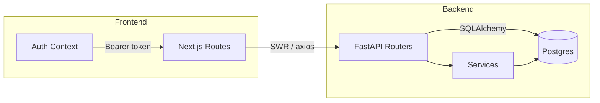

# Architecture Summary: PropWise

## System Overview
- **Frontend:** Next.js 13 app router with client components for dashboard, directory, ledgers, tickets, and reports. Shared `AuthProvider` manages JWT storage.
- **Backend:** FastAPI application with modular routers (`auth`, `dashboard`, `tenants`, `payments`, `tickets`, `ai`, `reports`) and SQLAlchemy ORM models. Column-level `org_id` enforces multi-tenancy.
- **Database:** PostgreSQL target schema (tests run against SQLite). Models include `Organization`, `User`, `Building`, `Unit`, `Tenant`, `Payment`, `Ticket`, `AuditLog`.
- **Auth:** JWT tokens generated via `/auth/login/access-token`, PBKDF2 password hashing, request dependencies injecting `org_id` and active user checks.
- **Deployment:** Docker Compose orchestrates FastAPI, Postgres, and Next.js services with `.env` configuration sourced from brief.

## Module Responsibilities
### Backend
- `app/api/deps.get_request_org_id` derives organization context from JWT and request headers to apply row-level security semantics.
- `services/compute_kpis`, `compute_trends`, `automation_panel`, and `load_student_activity` back the dashboard layout defined in the brief.
- `services/reporting.build_org_report` compiles Markdown template into PDF using seeded metrics; invoked by `/reports/org-monthly`.
- `services/monthly_summary` returns rules-based AI summary to satisfy `ai_feature: monthly_summary` with fallback when no LLM is configured.
- `scripts/seed_data.py` provisions organizations, users, tenants, payments, tickets per brief seeds.

### Frontend
- `src/lib/api.ts` configures axios with bearer token interception and typed helper methods.
- `src/context/AuthContext.tsx` exposes `login`, `logout`, and token state for pages to guard access.
- `src/app/dashboard/page.tsx` renders KPI cards, charts, heatmap, and automation panel with SWR fetching.
- Newly added pages (`/tenants`, `/payments`, `/tickets`, `/tickets/[id]`, `/reports`, `/login`) provide tabular views, detail drill-downs, PDF trigger, and AI summary execution respecting auth state.

## Data Flows

- Authenticated requests include JWT via axios interceptor → FastAPI dependencies validate token → SQLAlchemy queries filtered by `org_id`.
- Report generation fetches metrics, automation data, and trends before streaming PDF bytes to the browser.

## Cross-cutting Concerns
- **Security:** PBKDF2 hashing, JWT expiry, audit logging for create/update operations, `security_fail_on: high` enforced by gate scripts.
- **Performance:** Dashboard services aggregate data with indexed columns; perf metrics captured via `scripts/collect_perf.py` for gate compliance.
- **Testing:** Pytest fixtures set up in-memory SQLite with seeds, verifying auth flow, RLS behavior, and key endpoints to maintain ≥80% coverage.
- **Prototype Skip Handling:** FE build/test steps may be skipped under prototype profile; compliance report records reason and compensating validation steps.

## Open Items / Future Enhancements
- Expand notification stub into actual email/SMS delivery.
- Add tenant self-service portal and create/update flows on frontend.
- Introduce observability stack (structured logging, tracing) beyond basic logging.
