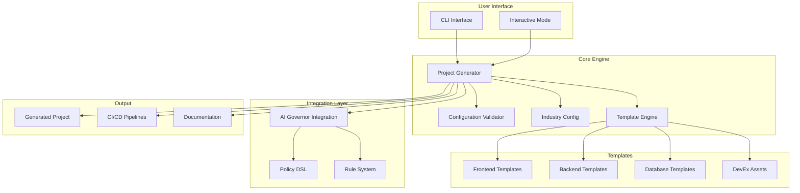

# Architecture Documentation

## Overview

The Client Project Generator is a sophisticated code generation system that creates production-ready applications with industry-specific configurations, compliance support, and integrated development workflows.

## System Architecture



## Core Components

### 1. CLI Interface (`scripts/generate_client_project.py`)

The main entry point that handles:
- Command-line argument parsing
- Interactive mode for guided setup
- Validation of user inputs
- Orchestration of the generation process

**Key Features:**
- Comprehensive argument validation
- Industry-aware prompts
- Dry-run capability
- Verbose output options

### 2. Project Generator (`project_generator/core/generator.py`)

The central orchestrator that:
- Coordinates all generation activities
- Manages file system operations
- Processes templates with variable substitution
- Integrates with external systems

**Responsibilities:**
- Directory structure creation
- Template selection and processing
- Integration coordination
- Git initialization

### 3. Configuration Validator (`project_generator/core/validator.py`)

Ensures configuration integrity:
- Technology compatibility validation
- Compliance requirement checking
- Industry-specific validation rules
- Feature compatibility verification

**Validation Matrix:**
```python
compatibility_matrix = {
    'frontend': {
        'nextjs': {
            'backend': ['fastapi', 'django', 'nestjs', 'go'],
            'auth': ['auth0', 'firebase', 'cognito'],
            'deploy': ['vercel', 'aws', 'azure', 'gcp']
        }
    }
}
```

### 4. Industry Configuration (`project_generator/core/industry_config.py`)

Manages industry-specific requirements:
- Default feature sets
- Compliance requirements
- Recommended technology stacks
- Security configurations

**Industry Support:**
- Healthcare (HIPAA)
- Finance (SOX, PCI)
- E-commerce (PCI, GDPR)
- SaaS (SOC2, GDPR)
- Enterprise (SOC2)

### 5. Template Engine (`project_generator/templates/template_engine.py`)

Generates code from templates:
- Language-specific code generation
- Framework-aware boilerplate
- Industry-specific components
- Compliance-ready patterns

## Template System

### Template Structure

```
template-packs/
├── frontend/
│   ├── nextjs/
│   │   ├── base/          # Minimal setup
│   │   ├── enterprise/    # Enterprise features
│   │   └── compliance/    # Compliance-ready
│   └── [other frameworks]
├── backend/
│   └── [framework]/[variant]/
├── database/
│   └── [database]/[configuration]/
└── devex/
    └── [tool configurations]
```

### Template Variables

Templates use double-brace syntax for substitution:
- `{{PROJECT_NAME}}` - Project identifier
- `{{INDUSTRY}}` - Industry vertical
- `{{BACKEND}}` - Backend framework
- `{{COMPLIANCE}}` - Compliance requirements

### Template Processing Pipeline

1. **Selection**: Choose appropriate template variant
2. **Loading**: Read template files
3. **Processing**: Replace variables
4. **Validation**: Ensure output validity
5. **Writing**: Save processed files

## Policy DSL System

### Policy Structure

```yaml
industry_policies:
  healthcare:
    constraints:
      compliance: ["hipaa"]
      security_level: "maximum"
    web_stack:
      required:
        frontend: ["nextjs", "nuxt"]
        backend: ["fastapi", "django"]
```

### Policy Evaluation

1. **Load Policies**: Read YAML configuration
2. **Match Context**: Find applicable policies
3. **Validate Stack**: Check technology compatibility
4. **Apply Constraints**: Enforce requirements
5. **Generate Report**: Document decisions

## AI Governor Integration

### Integration Points

1. **Rule Copying**: Transfer master rules
2. **Workflow Setup**: Configure AI workflows
3. **Validation**: Policy compliance checking
4. **Instructions**: Generate AI guidance
5. **Reporting**: Integration documentation

### Workflow Configuration

```json
{
  "workflows": {
    "analyze": "dev-workflow/1-analyze-and-plan-prd.md",
    "plan": "dev-workflow/2-create-actionable-plan.md",
    "execute": "dev-workflow/3-execute-tasks-parallel.md",
    "review": "dev-workflow/4-retrospective-learnings.md"
  }
}
```

## CI/CD Pipeline Architecture

### Pipeline Stages

1. **Lint Stage**
   - Code style checking
   - Static analysis
   - Security linting

2. **Test Stage**
   - Unit tests
   - Integration tests
   - E2E tests
   - Coverage analysis

3. **Security Stage**
   - Dependency scanning
   - SAST/DAST
   - Secret detection
   - Container scanning

4. **Build Stage**
   - Docker image creation
   - Asset optimization
   - Version tagging

5. **Deploy Stage**
   - Environment-specific deployment
   - Health checks
   - Smoke tests
   - Rollback capability

### Quality Gates

```yaml
quality_gates:
  code_quality:
    lint:
      threshold: 0
      blocking: true
  test_coverage:
    unit_tests:
      threshold: 80  # Healthcare/Finance
      threshold: 70  # Others
  security:
    dependency_scan:
      critical_threshold: 0
```

## Security Architecture

### Security Layers

1. **Code Security**
   - Input validation templates
   - Secure defaults
   - Encryption utilities

2. **Infrastructure Security**
   - Container security
   - Network policies
   - Secret management

3. **Compliance Security**
   - Audit logging
   - Access controls
   - Data protection

### Compliance Implementation

#### HIPAA (Healthcare)
- PHI encryption (AES-256)
- Audit logging framework
- Session management (15 min)
- Access control templates

#### GDPR (Privacy)
- Consent management
- Data portability
- Deletion workflows
- Privacy by design

#### SOX (Financial)
- Change control
- Audit trails
- Segregation of duties
- Financial controls

#### PCI (Payment)
- Cardholder data protection
- Network segmentation
- Tokenization support
- Security scanning

## Extensibility

### Adding New Technologies

1. **Create Template Pack**
   ```
   template-packs/<category>/<technology>/
   ├── base/
   ├── enterprise/
   └── compliance/
   ```

2. **Update Template Engine**
   ```python
   def _<technology>_template(self, ...):
       # Template generation logic
   ```

3. **Add Validation Rules**
   ```python
   compatibility_matrix['<category>']['<technology>'] = {
       'compatible_with': [...]
   }
   ```

4. **Update Policy DSL**
   ```yaml
   technology_compatibility:
     <technology>:
       compatible_backends: [...]
   ```

### Adding Industries

1. **Define Configuration**
   ```python
   'new_industry': {
       'default_features': [...],
       'compliance': [...],
       'recommended_stack': {...}
   }
   ```

2. **Create Compliance Rules**
3. **Add Policy Definitions**
4. **Update Documentation**

## Performance Considerations

### Optimization Strategies

1. **Template Caching**: Cache parsed templates
2. **Parallel Processing**: Generate components concurrently
3. **Lazy Loading**: Load templates on demand
4. **Minimal I/O**: Batch file operations

### Scalability

- Modular architecture supports extension
- Template system allows easy additions
- Policy DSL enables configuration without code changes
- Integration layer supports multiple frameworks

## Error Handling

### Error Categories

1. **Validation Errors**: Invalid configuration
2. **Template Errors**: Missing or corrupt templates
3. **Integration Errors**: External system failures
4. **File System Errors**: Permission or space issues

### Recovery Strategies

- Graceful degradation
- Detailed error messages
- Rollback capability
- Retry mechanisms

## Future Enhancements

### Planned Features

1. **Cloud-Native Templates**: Kubernetes, serverless
2. **More Frameworks**: Vue.js, Svelte, Spring Boot
3. **Infrastructure as Code**: Terraform, Pulumi
4. **Advanced Compliance**: ISO 27001, FedRAMP
5. **Multi-Cloud Support**: Enhanced cloud templates

### Architecture Evolution

- Plugin system for custom generators
- Web UI for project configuration
- Template marketplace
- Real-time collaboration features

## Conclusion

The Client Project Generator architecture is designed for:
- **Extensibility**: Easy to add new technologies
- **Maintainability**: Clear separation of concerns
- **Reliability**: Comprehensive validation
- **Performance**: Efficient generation process
- **Compliance**: Built-in regulatory support

This architecture enables rapid, consistent, and compliant project generation across various industries and technology stacks.