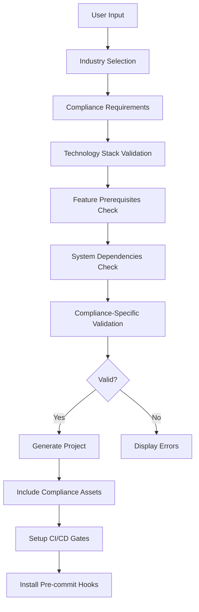

# Compliance Documentation

## Overview

The Client Project Generator provides comprehensive compliance support for major industry regulations including HIPAA, GDPR, SOX, and PCI DSS. This document outlines the compliance patterns, requirements, and implementation details.

## Compliance Architecture

### Compliance Integration Points

1. **Pre-Generation Validation**: Compliance requirements are validated before project generation
2. **Template Selection**: Compliance-specific templates are selected based on industry requirements
3. **Generated Assets**: Compliance-ready code, configuration, and documentation are included
4. **CI/CD Integration**: Compliance checks are integrated into the build pipeline
5. **Runtime Enforcement**: Generated projects include compliance monitoring and enforcement

### Compliance Validation Flow



## Supported Compliance Standards

### HIPAA (Health Insurance Portability and Accountability Act)

**Industry**: Healthcare  
**Scope**: Protected Health Information (PHI) handling

#### Requirements
- **Encryption**: AES-256 encryption at rest and in transit
- **Access Controls**: Role-based access control (RBAC)
- **Audit Logging**: Comprehensive audit trails for all PHI access
- **Session Management**: 15-minute session timeout
- **Data Backup**: Encrypted backup and recovery procedures
- **Business Associate Agreements**: Required for cloud providers

#### Implementation
```python
# Compliance requirements in validator
'hipaa': {
    'required_features': ['encryption', 'audit_logging', 'access_control'],
    'required_auth': ['auth0', 'cognito'],  # BAA-compliant providers
    'deploy_allowed': ['aws', 'azure'],     # BAA available
    'warnings': ['Requires BAA with cloud provider', 'PHI data handling procedures needed']
}
```

#### Generated Assets
- PHI encryption utilities
- Audit logging middleware
- Access control templates
- Session management configuration
- Data retention policies
- Incident response procedures

### GDPR (General Data Protection Regulation)

**Industry**: EU Privacy  
**Scope**: Personal data processing and privacy rights

#### Requirements
- **Consent Management**: Granular consent collection and tracking
- **Data Portability**: Export user data in machine-readable format
- **Right to Deletion**: Complete data removal capabilities
- **Privacy by Design**: Built-in privacy protections
- **Data Minimization**: Collect only necessary data
- **Breach Notification**: 72-hour notification procedures

#### Implementation
```python
'gdpr': {
    'required_features': ['data_privacy', 'consent_management', 'data_deletion'],
    'warnings': ['Privacy policy required', 'Data processing agreements needed']
}
```

#### Generated Assets
- Consent management system
- Data export/import utilities
- Data deletion workflows
- Privacy policy templates
- Cookie consent management
- Data processing agreements

### SOX (Sarbanes-Oxley Act)

**Industry**: Financial Services  
**Scope**: Financial reporting and internal controls

#### Requirements
- **Change Control**: Documented change management procedures
- **Audit Trails**: Immutable audit logs for financial data
- **Segregation of Duties**: Separation of authorization and execution
- **Financial Controls**: Automated financial data validation
- **Documentation**: Comprehensive process documentation
- **Testing**: Regular control testing procedures

#### Implementation
```python
'sox': {
    'required_features': ['audit_trails', 'access_control', 'change_management'],
    'required_auth': ['cognito', 'auth0'],
    'warnings': ['Financial controls documentation required']
}
```

#### Generated Assets
- Change control workflows
- Financial audit logging
- Role-based access controls
- Financial data validation
- Control testing frameworks
- Documentation templates

### PCI DSS (Payment Card Industry Data Security Standard)

**Industry**: Payment Processing  
**Scope**: Cardholder data protection

#### Requirements
- **Data Protection**: Encrypt cardholder data at rest and in transit
- **Network Security**: Firewall and network segmentation
- **Access Control**: Restrict access to cardholder data
- **Monitoring**: Continuous monitoring and testing
- **Tokenization**: Replace sensitive data with tokens
- **Security Policies**: Comprehensive security documentation

#### Implementation
```python
'pci': {
    'required_features': ['encryption', 'tokenization', 'secure_storage'],
    'warnings': ['PCI DSS assessment required', 'Network segmentation needed']
}
```

#### Generated Assets
- Cardholder data encryption
- Tokenization services
- Network security configurations
- Payment processing templates
- Security monitoring tools
- PCI compliance checklists

## Compliance Validation System

### Validation Layers

#### 1. Pre-Generation Validation
```python
def validate_compliance_prerequisites(args):
    """Validate compliance requirements before generation"""
    errors = []
    warnings = []
    
    if 'hipaa' in args.compliance:
        if not args.backend:
            errors.append("HIPAA requires backend for data processing")
        if args.auth not in ['auth0', 'cognito']:
            errors.append("HIPAA requires BAA-compliant auth provider")
        if args.deploy not in ['aws', 'azure']:
            errors.append("HIPAA requires BAA-compliant deployment")
    
    return errors, warnings
```

#### 2. Technology Stack Validation
```python
compatibility_matrix = {
    'healthcare': {
        'required_auth': ['auth0', 'cognito'],
        'prohibited_database': ['firebase'],  # No BAA
        'prohibited_deploy': ['vercel']       # No BAA
    }
}
```

#### 3. Feature Prerequisites
```python
def _validate_features(args):
    """Validate feature requirements for compliance"""
    if 'hipaa' in args.compliance:
        required = ['encryption', 'audit_logging', 'access_control']
        missing = [f for f in required if f not in args.features]
        if missing:
            errors.append(f"HIPAA requires features: {missing}")
```

### Quality Gates

#### Compliance-Specific Gates
```yaml
compliance_gates:
  hipaa:
    encryption_check: true
    audit_logging: true
    access_control_review: true
  gdpr:
    privacy_impact: true
    consent_tracking: true
    data_retention_check: true
  sox:
    change_control: true
    segregation_of_duties: true
    audit_trail_validation: true
  pci:
    cardholder_data_check: true
    network_segmentation: true
    encryption_validation: true
```

## Generated Compliance Assets

### Code Templates

#### HIPAA-Compliant API Endpoint
```python
@router.post("/patients/{patient_id}/records")
async def create_patient_record(
    patient_id: str,
    record: PatientRecord,
    current_user: User = Depends(get_current_user),
    audit_logger: AuditLogger = Depends(get_audit_logger)
):
    # Verify user has access to this patient
    if not await verify_patient_access(current_user.id, patient_id):
        raise HTTPException(status_code=403, detail="Access denied")
    
    # Encrypt PHI data
    encrypted_record = encrypt_phi(record.dict())
    
    # Create record with audit trail
    result = await create_record(encrypted_record)
    
    # Log access for audit
    await audit_logger.log_access(
        user_id=current_user.id,
        action="create_patient_record",
        resource_id=result.id,
        patient_id=patient_id
    )
    
    return result
```

#### GDPR Data Export
```python
@router.get("/users/{user_id}/data-export")
async def export_user_data(
    user_id: str,
    current_user: User = Depends(get_current_user)
):
    if current_user.id != user_id:
        raise HTTPException(status_code=403, detail="Access denied")
    
    # Collect all user data
    user_data = await collect_user_data(user_id)
    
    # Generate export package
    export_package = await generate_data_export(user_data)
    
    return {
        "download_url": export_package.url,
        "expires_at": export_package.expires_at,
        "format": "json"
    }
```

### Configuration Templates

#### HIPAA Security Configuration
```yaml
# Security configuration for HIPAA compliance
security:
  encryption:
    algorithm: "AES-256-GCM"
    key_rotation_days: 90
  session:
    timeout_minutes: 15
    require_mfa: true
  audit:
    log_all_access: true
    retention_days: 2555  # 7 years
  access_control:
    rbac_enabled: true
    principle_of_least_privilege: true
```

#### GDPR Privacy Configuration
```yaml
# Privacy configuration for GDPR compliance
privacy:
  consent:
    granular_consent: true
    consent_expiry_days: 365
  data_retention:
    default_retention_days: 1095  # 3 years
    anonymization_after_days: 2555  # 7 years
  data_subject_rights:
    export_enabled: true
    deletion_enabled: true
    rectification_enabled: true
```

### CI/CD Integration

#### Compliance Testing Pipeline
```yaml
name: Compliance Tests
on: [push, pull_request]

jobs:
  compliance-tests:
    runs-on: ubuntu-latest
    steps:
      - uses: actions/checkout@v3
      
      - name: Run HIPAA Compliance Tests
        if: contains(github.event.head_commit.message, 'hipaa')
        run: |
          python .cursor/tools/check_compliance.py --standard hipaa
          
      - name: Run GDPR Compliance Tests
        if: contains(github.event.head_commit.message, 'gdpr')
        run: |
          python .cursor/tools/check_compliance.py --standard gdpr
          
      - name: Run Security Scan
        run: |
          python .cursor/tools/validate_rules.py --security-only
```

## Compliance Monitoring

### Audit Logging

#### Audit Event Structure
```json
{
  "timestamp": "2024-01-15T10:30:00Z",
  "event_id": "audit_001",
  "user_id": "user_123",
  "action": "access_patient_record",
  "resource_id": "patient_456",
  "ip_address": "192.168.1.100",
  "user_agent": "Mozilla/5.0...",
  "result": "success",
  "compliance_standard": "hipaa",
  "data_classification": "phi"
}
```

### Compliance Reporting

#### Automated Compliance Reports
```python
def generate_compliance_report(project_path: Path, standards: List[str]):
    """Generate compliance report for generated project"""
    report = {
        "project_name": project_path.name,
        "generated_at": datetime.now().isoformat(),
        "compliance_standards": standards,
        "checks": []
    }
    
    for standard in standards:
        checks = run_compliance_checks(project_path, standard)
        report["checks"].extend(checks)
    
    return report
```

## Best Practices

### Development Guidelines

1. **Privacy by Design**: Build privacy protections into every feature
2. **Security by Default**: Use secure defaults for all configurations
3. **Audit Everything**: Log all access to sensitive data
4. **Encrypt by Default**: Encrypt sensitive data at rest and in transit
5. **Least Privilege**: Grant minimum necessary access
6. **Regular Testing**: Test compliance controls regularly

### Implementation Checklist

- [ ] Compliance requirements identified and validated
- [ ] Appropriate technology stack selected
- [ ] Security controls implemented
- [ ] Audit logging configured
- [ ] Access controls established
- [ ] Data encryption enabled
- [ ] CI/CD gates configured
- [ ] Documentation generated
- [ ] Testing procedures established
- [ ] Monitoring configured

## Troubleshooting

### Common Issues

#### HIPAA Compliance
- **Issue**: Missing BAA with cloud provider
- **Solution**: Use AWS or Azure with signed BAA
- **Prevention**: Validate deployment target in pre-generation

#### GDPR Compliance
- **Issue**: Missing consent management
- **Solution**: Implement granular consent collection
- **Prevention**: Include consent management in required features

#### SOX Compliance
- **Issue**: Insufficient audit trails
- **Solution**: Implement comprehensive audit logging
- **Prevention**: Validate audit requirements in compliance check

### Validation Errors

```bash
# Common validation errors and solutions
ERROR: HIPAA requires backend for data processing
SOLUTION: Add --backend fastapi or --backend django

ERROR: PCI requires encryption for cardholder data
SOLUTION: Add --features encryption,tokenization

ERROR: GDPR requires consent management
SOLUTION: Add --features consent_management,data_privacy
```

## Future Enhancements

### Planned Compliance Standards
- ISO 27001 (Information Security Management)
- FedRAMP (Federal Risk and Authorization Management)
- SOC 2 Type II (Service Organization Control)
- CCPA (California Consumer Privacy Act)
- PIPEDA (Personal Information Protection and Electronic Documents Act)

### Enhanced Features
- Automated compliance testing
- Real-time compliance monitoring
- Compliance dashboard
- Regulatory change notifications
- Third-party compliance validation

## Conclusion

The Client Project Generator provides comprehensive compliance support through:

- **Pre-validation**: Ensures compliance requirements are met before generation
- **Template Integration**: Includes compliance-ready code and configuration
- **CI/CD Integration**: Automates compliance testing and validation
- **Monitoring**: Provides audit logging and compliance reporting
- **Documentation**: Generates compliance documentation and procedures

This approach ensures that generated projects are not only compliant by design but also maintain compliance throughout their lifecycle.
