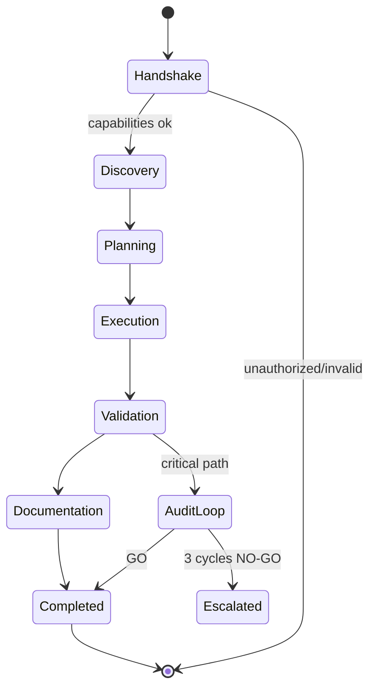
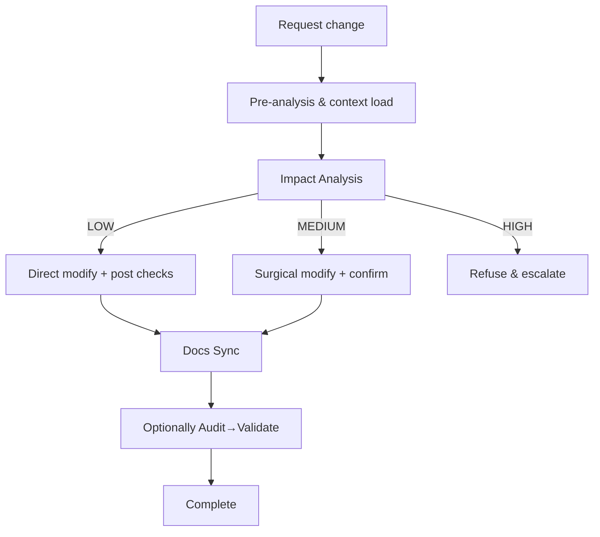
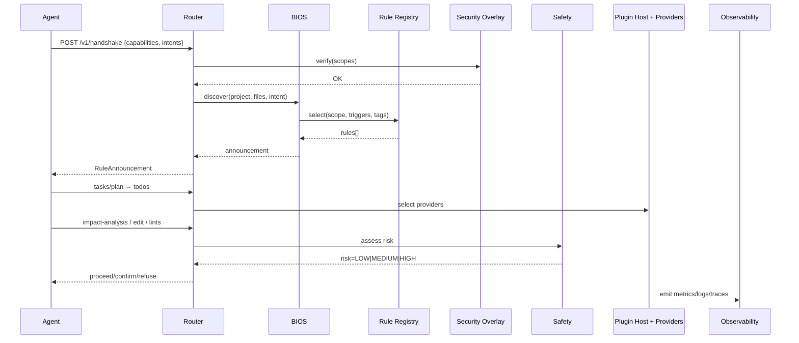

### AI Governor Framework — Technical Specification

This specification describes internal workings, lifecycle/state, data flows, APIs, events, plugin SPI, and non-functional facets required to integrate with and extend the AI Governor Framework.

---

## 1. Overview

The AI Governor Framework orchestrates rule-driven development workflows for AI agents. It enforces precedence across security, audit/validation, modification safety, quality, complex-feature context, collaboration, documentation, and workflow routing. The framework exposes typed interfaces (REST, gRPC, events) and a provider model for tooling.

Core goals:
- Deterministic governance via precedence and explicit protocols
- Tool-agnostic execution via capability discovery and plugin host
- Reproducibility through audits, validations, and artifacts
- Extensibility with clean SPI and transport-neutral contracts

---

## 2. Architecture

Components:
- Router: Detects workflow commands, routes to protocol documents.
- BIOS (Context Discovery): Loads rules and project context, announces active rules.
- Security Overlay (F8): Enforces security/compliance controls across all actions.
- Collaboration Rule: Planning, clarification, task management, tool usage.
- Safety Protocol: Pre-analysis, impact assessment, risk gating, rollback.
- Quality Checklist: Baseline robustness, clarity, and conventions.
- Complex Feature Context: Preservation for sophisticated features.
- Docs Integrity: Post-change documentation synchronization.
- Auditor/Validator: Independent audit/validate loop with artifacts.
- Rule Registry: Stores rule metadata and bodies; selection engine.
- Plugin Host: Selects providers for search/edit/lint/terminal/notebook.
- Observability: Structured logs, metrics, traces; correlation IDs.
- Event Bus: Topic-based pub/sub for governance events.

---

## 3. Lifecycle & State Machines

### 3.1 Session Lifecycle



### 3.2 Modification Workflow (Risk-Gated)



---

## 4. Data Flow



---

## 5. Interfaces

### 5.1 REST Endpoints

- POST `/v1/handshake` → CapabilityHandshakeRequest → RuleAnnouncementResponse
- GET `/v1/rules` → list rules
- POST `/v1/context/discover` → ContextDiscoverRequest → ContextDiscoverResponse
- POST `/v1/tasks/plan` → PlanRequest → PlanResponse
- POST `/v1/todos` → TodoBatchUpsert
- POST `/v1/impact-analysis` → ImpactAnalysis
- POST `/v1/modification-report` → ModificationReport
- POST `/v1/docs/sync` → DocsSyncProposal
- POST `/v1/audit/run` → AuditRunRequest
- POST `/v1/validate/run` → ValidationRunRequest
- GET `/v1/events` (SSE) → governance event stream

Headers:
- Authorization: Bearer <jwt> | mTLS client cert
- X-Gov-Version: semver (negotiated)
- Idempotency-Key: UUID for POST

### 5.2 gRPC (excerpt)

```proto
syntax = "proto3";
package gov.v1;

service Governor {
  rpc Handshake(CapabilityHandshakeRequest) returns (RuleAnnouncementResponse);
  rpc Discover(ContextDiscoverRequest) returns (ContextDiscoverResponse);
  rpc Plan(PlanRequest) returns (PlanResponse);
  rpc Impact(ImpactAnalysis) returns (ImpactDecision);
  rpc ModificationReport(ModificationReport) returns (Ack);
  rpc AuditRun(AuditRunRequest) returns (AuditAck);
  rpc ValidateRun(ValidationRunRequest) returns (ValidationAck);
  rpc Events(EventsRequest) returns (stream GovernanceEvent);
}
```

### 5.3 Event Topics

- `gov.rule.announcement`
- `gov.task.updated`
- `gov.safety.impact`
- `gov.modification.report`
- `gov.docs.sync.requested`
- `gov.audit.created`
- `gov.validation.created`
- `gov.security.alert`

---

## 6. Schemas (JSON)

CapabilityHandshakeRequest, RuleAnnouncementResponse, ImpactAnalysis, ModificationReport, AuditRunRequest, ValidationRunRequest are defined in `integration-architecture.md`. These schemas are normative and versioned.

Additional:

```json
{
  "$schema": "https://json-schema.org/draft/2020-12/schema",
  "$id": "https://example.com/schemas/PlanRequest.json",
  "type": "object",
  "required": ["goal", "context"],
  "properties": {
    "goal": {"type": "string"},
    "context": {"type": "object"}
  }
}
```

```json
{
  "$schema": "https://json-schema.org/draft/2020-12/schema",
  "$id": "https://example.com/schemas/PlanResponse.json",
  "type": "object",
  "required": ["todos"],
  "properties": {
    "todos": {
      "type": "array",
      "items": {
        "type": "object",
        "required": ["content", "status", "id"],
        "properties": {
          "content": {"type": "string"},
          "status": {"enum": ["pending", "in_progress", "completed", "cancelled"]},
          "id": {"type": "string"}
        }
      }
    }
  }
}
```

---

## 7. Plugin Service Provider Interface (SPI)

### 7.1 Provider Contracts

```typescript
export interface ToolProvider {
  readonly name: string;
  capabilities(): string[]; // e.g. ["search","edit","lint","terminal","notebook"]
  search(query: string, options?: object): Promise<object>;
  readFile(path: string): Promise<string>;
  writeFile(path: string, content: string): Promise<void>;
  runLinter(paths: string[]): Promise<object[]>;
  runCommand(cmd: string, opts?: { background?: boolean }): Promise<{ status: number; stdout: string; stderr: string }>;
}

export interface RuleRegistry {
  list(scope?: string): Promise<RuleMeta[]>;
  load(selectors: { scope?: string; triggers?: string[]; tags?: string[] }): Promise<Rule[]>;
}
```

### 7.2 Provider Selection

- Capability-first: match requested operation to providers advertising that capability.
- Policy filters: security constraints may disallow certain providers.
- Health and latency: prefer healthy, low-latency providers.
- Fallback: degrade gracefully to alternative providers.

---

## 8. Security Model

- Transport security: TLS everywhere; mTLS for service-to-service.
- Authentication: OAuth2/JWT or mTLS; local API keys only in development.
- Authorization: Scope-based; least privilege.
- Data protection: No hardcoded secrets; secrets in vault; input validation and sanitization.
- Audit trail: Comprehensive logs with user/agent identity and correlation IDs.

---

## 9. Observability

- Structured logs with levels and fields (requestId, agent, rule, resource).
- Metrics: request counts, latencies, error rates, rule activations, risk distribution.
- Tracing: distributed traces across Router, BIOS, providers; W3C trace-context headers.

---

## 10. Error Handling

- Consistent error envelope:
```json
{ "error": { "code": "string", "message": "string", "details": {} } }
```
- Idempotent POST with `Idempotency-Key` to avoid duplicate effects.
- Retry guidance via `Retry-After` header and exponential backoff.

---

## 11. Versioning & Compatibility

- Semantic version for APIs and schema IDs.
- `X-Gov-Version` header negotiates compatible contract.
- Deprecations announced via events and headers; sunset dates provided.

---

## 12. Configuration

- Rule paths: discovery roots for `master-rules`, `common-rules`, `project-rules`.
- Provider registry: static config + dynamic health.
- Security: accepted auth methods, required scopes, allowed origins.
- Observability: sinks for logs/metrics/traces; sampling.

---

## 13. Governance Alignment

Precedence: Security → Auditor/Validator → Safety → Quality → Complex Feature → Collaboration → Docs → Router.

Conflict resolution: higher priority overrides; equal priority merges; otherwise clarify and pause.

---

## 14. Integration Guide (AI Agent)

1) Call `POST /v1/handshake` with agent identity, capabilities, intents.
2) Receive RuleAnnouncement; adhere to required protocols.
3) Use planning/task APIs; adopt Tool Usage Protocol by discovering providers via capability listing.
4) Before code changes, submit `impact-analysis`; honor gating decisions.
5) After changes, submit `modification-report`; propose `docs/sync` if behavior changed.
6) For critical paths, run `audit/run` then `validate/run` until GO; record artifacts.

---

## 15. Reference Documents

- `docs/master-rules-logic-flows.md`: rule activations and decision trees
- `docs/integration-architecture.md`: diagrams, endpoints, events, and schemas

