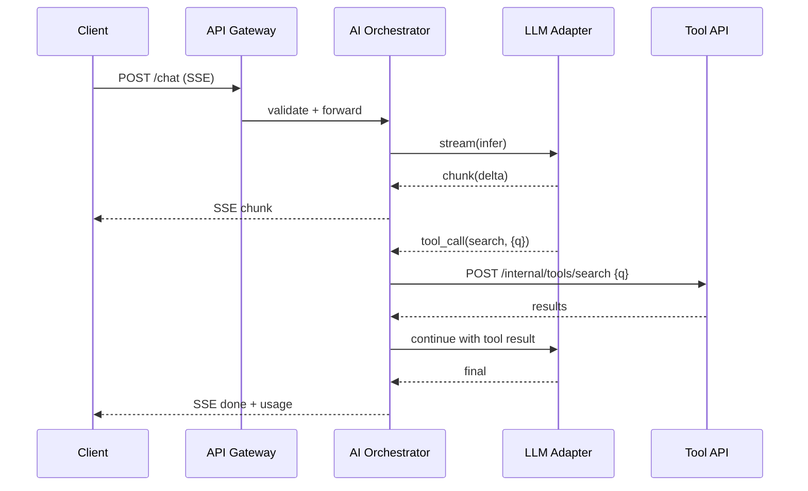

## Overview

This document describes how the platform integrates with external AI systems (LLM providers, vector databases, model gateways, and internal inference services). It defines the reference architecture, required interfaces, protocols, and security considerations to enable safe extension and vendor portability.

## High-level Architecture

```mermaid
flowchart TB
  subgraph Frontend [Frontend (Web/Client)]
    UI[App UI]
  end

  subgraph Backend [Backend API]
    GW[API Gateway / BFF]
    SVC[AI Orchestrator Service]
    AUTH[AuthN/Z]
    AUD[Audit & Telemetry]
  end

  subgraph Adapters [Integration Layer]
    LLM1[LLM Provider Adapter A]
    LLM2[LLM Provider Adapter B]
    VEC[Vector DB Adapter]
    TOOLS[Tool/Function Call Adapter]
    FILES[File Storage Adapter]
  end

  subgraph Providers [External/Pluggable Systems]
    P1[(LLM API)]
    P2[(Embedding API)]
    P3[(Vector DB)]
    P4[(Tool APIs)]
    P5[(Object Storage)]
  end

  UI -->|HTTPS JSON/SSE| GW --> SVC
  SVC --> AUTH
  SVC --> AUD
  SVC --> LLM1
  SVC --> LLM2
  SVC --> VEC --> P3
  SVC --> TOOLS --> P4
  SVC --> FILES --> P5
  LLM1 --> P1
  LLM2 --> P1
  SVC -->|Embeddings| P2
```

### Key Responsibilities
- API Gateway/BFF: request validation, rate limiting, coarse authZ, response shaping.
- AI Orchestrator: prompt construction, tool routing, provider selection, retries, streaming, cost/latency budgets.
- Adapters: protocol translation, provider-specific quirks hidden behind stable interfaces.
- Providers: external AI/model services and data stores.
- Cross-cutting: observability, audit logging, PII redaction, policy enforcement.

## Interfaces and Protocols

### 1) LLM Inference Interface (Provider-agnostic)

Endpoint (internal): `POST /internal/ai/v1/llm/infer`

Request:
```json
{
  "model": "provider:model-id",
  "input": [{"role": "system", "content": "..."}, {"role": "user", "content": "..."}],
  "tools": [{"name": "search", "description": "...", "parameters": {"type": "object", "properties": {"q": {"type": "string"}}, "required": ["q"]}}],
  "response_format": {"type": "text"},
  "stream": true,
  "temperature": 0.2,
  "max_tokens": 1024,
  "metadata": {"tenant_id": "t_123", "request_id": "..."}
}
```

Response (non-stream):
```json
{
  "id": "run_abc",
  "output": [{"role": "assistant", "content": "..."}],
  "tool_calls": [{"name": "search", "arguments": {"q": "..."}, "id": "call1"}],
  "usage": {"input_tokens": 123, "output_tokens": 456, "cost": 0.0012},
  "provider": "provider",
  "model": "model-id",
  "latency_ms": 842
}
```

Response (stream, SSE):
```
event: meta
data: {"id":"run_abc","provider":"provider","model":"model-id"}

event: chunk
data: {"delta":"partial text"}

event: tool_call
data: {"id":"call1","name":"search","arguments":{"q":"..."}}

event: done
data: {"usage":{"input_tokens":123,"output_tokens":456,"cost":0.0012}}
```

Transport: HTTPS with JSON for non-streaming; Server-Sent Events (SSE) for streaming. WebSockets allowed as optional alternative.

Auth: mTLS service-to-service plus JWT with scopes: `ai.infer`, `ai.stream`.

### 2) Embeddings Interface

Endpoint: `POST /internal/ai/v1/embeddings`

Request:
```json
{
  "model": "provider:embed-medium",
  "input": ["text chunk 1", "text chunk 2"],
  "metadata": {"tenant_id": "t_123", "doc_id": "d_456"}
}
```

Response:
```json
{
  "vectors": [[0.12, -0.3, ...], [0.05, 0.22, ...]],
  "dim": 1536,
  "usage": {"input_tokens": 234, "cost": 0.0003},
  "provider": "provider"
}
```

### 3) Vector Store Interface

CRUD over collections and points. Protocols supported: REST+JSON primary; optional gRPC.

- `POST /internal/vec/v1/collections`
- `PUT /internal/vec/v1/collections/{name}/points` (upsert)
- `POST /internal/vec/v1/collections/{name}/query`

Query request example:
```json
{
  "vector": [0.12, -0.3, ...],
  "top_k": 20,
  "filter": {"tenant_id": "t_123"},
  "include": ["metadata", "score"]
}
```

### 4) Tool/Function Calling Interface

Tool registry contract exposed to the orchestrator. Tools are HTTP endpoints with JSON Schemas.

Schema:
```json
{
  "name": "search",
  "description": "Full-text search over documents",
  "endpoint": "POST /internal/tools/search",
  "parameters": {
    "type": "object",
    "properties": {"q": {"type": "string"}, "limit": {"type": "integer", "minimum": 1, "maximum": 100}},
    "required": ["q"]
  },
  "auth": {"type": "service_jwt", "scope": "tool.search"}
}
```

### 5) File/Object Storage Interface

Abstraction over S3-compatible storage.

- `POST /internal/files/v1/objects` (multipart or signed PUT)
- `GET /internal/files/v1/objects/{id}` (signed GET)

Security: server-side encryption, key policy per-tenant, presigned URLs TTL ≤ 15m.

## Provider Adapter Contract

Each provider adapter implements the following interface (example in TypeScript):

```ts
export interface LlmAdapter {
  infer(request: LlmInferRequest, options?: RunOptions): Promise<LlmInferResponse>;
  stream(request: LlmInferRequest, onEvent: (e: StreamEvent) => void, options?: RunOptions): Promise<void>;
  embeddings(request: EmbeddingsRequest): Promise<EmbeddingsResponse>;
  health(): Promise<HealthStatus>;
}
```

Behavioral requirements:
- Translate tool schemas to provider-native formats (e.g., OpenAI, Anthropic, Vertex).
- Implement retry with backoff on 5xx, circuit-breaker on persistent failure.
- Normalize token/usage metrics and map to unified cost units.
- Enforce rate limits per-tenant and per-provider.

## Authentication and Authorization

- External → Gateway: OAuth2/OIDC (PKCE) for users; service JWT for first-party services.
- Internal services: mTLS + service JWT with fine-grained scopes (SPIFFE/SPIRE optional).
- Tenant isolation via `tenant_id` claim and collection partitioning.
- Redaction of sensitive fields before persistence and logging.

## Observability and Audit

- Tracing: W3C Trace Context, propagate `traceparent` across adapters.
- Metrics: latency, token usage, error rates, saturation per model.
- Logs: structured JSON with PII redaction, request/response sampling.
- Audit: immutable log of prompts, tool calls, file access, with hash chaining.

## Versioning and Compatibility

- All internal APIs are versioned with `/v{n}`; breaking changes require a new version.
- Adapters declare `capabilities` and `semver` compatibility range.
- Feature flags control model availability and tool registry entries per tenant.

## Security & Compliance

- No secrets in code; use secret manager. Rotate provider keys quarterly.
- Data residency controls for storage and vector DB per region.
- DLP scanning on file uploads; content policy enforcement at orchestrator.

## Extension Points

1. Add a new LLM provider: implement `LlmAdapter`, register with orchestrator via DI.
2. Add a new tool: publish JSON Schema and endpoint; orchestrator discovers via registry.
3. Swap vector DB: implement vector CRUD/query interface; rebind via config.
4. Custom routing: plug a policy module for model selection based on cost/latency/SLAs.

## Sequence Examples

### Chat with Tool Use (Streaming)



---

Appendix: JSON Schemas are defined in `/docs/schemas/ai/*` (to be added as needed).

