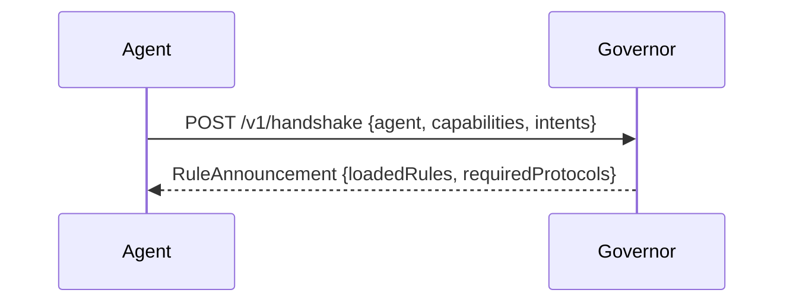
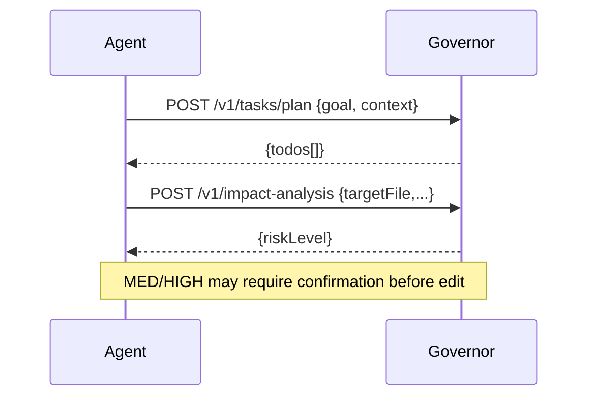
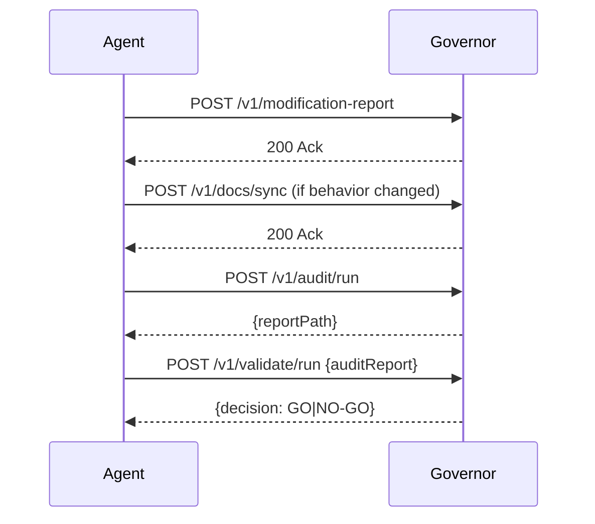

### AI Governor Framework — Communication Protocol Specification

This specification defines how the AI Governor Framework communicates and integrates with external AI systems, covering transports, negotiation, data formats, APIs, streaming, events, error envelopes, authentication/authorization, and handoff procedures.

---

## 1) Scope and Goals

- Ensure deterministic, secure, and extensible interop between Governor and external agents/services.
- Support HTTP/JSON, gRPC, SSE/WebSocket, and event buses (NATS/Kafka/RabbitMQ).
- Provide versioned, typed contracts for requests, responses, and events.

---

## 2) Transport and Negotiation

- Transports: HTTP/1.1+TLS, HTTP/2 (gRPC), WebSocket/SSE, event bus (pub/sub).
- Version negotiation: `X-Gov-Version: <semver>` header on HTTP; gRPC `gov.v1` package; event topic suffixes `.v1` when needed.
- Content types: `application/json; charset=utf-8`; gRPC protobuf messages.
- Compression: Accept `gzip`.

---

## 3) Authentication & Authorization

- AuthN: OAuth2 Bearer (JWT) or mTLS; API keys only for local/dev.
- AuthZ: Scope-based permissions: `rule:read`, `rule:apply`, `context:discover`, `task:write`, `tool:exec`, `repo:read`, `repo:write`, `audit:run`, `validate:run`, `logs:write`.
- Token binding: All calls must include valid scope for the operation; otherwise `403`.

---

## 4) Error Envelope

All error responses use a consistent envelope:

```json
{ "error": { "code": "string", "message": "string", "details": {} } }
```

HTTP status codes: `400` invalid input, `401` unauthenticated, `403` unauthorized, `409` conflict, `422` semantic error, `429` rate limit, `5xx` server.

---

## 5) REST API Contracts

Base path: `/v1`

- `POST /handshake`
  - Request: `CapabilityHandshakeRequest`
  - Response: `RuleAnnouncementResponse`
  - Purpose: Capability exchange, rule loading, protocol requirements.

- `GET /rules`
  - Response: List of rule metadata

- `POST /context/discover`
  - Request: `ContextDiscoverRequest`
  - Response: `ContextDiscoverResponse`

- `POST /tasks/plan`
  - Request: `PlanRequest`
  - Response: `PlanResponse`

- `POST /todos`
  - Request: `TodoBatchUpsert`

- `POST /impact-analysis`
  - Request: `ImpactAnalysis`
  - Response: `ImpactDecision { riskLevel: LOW|MEDIUM|HIGH }`

- `POST /modification-report`
  - Request: `ModificationReport`

- `POST /docs/sync`
  - Request: `DocsSyncProposal`

- `POST /audit/run`
  - Request: `AuditRunRequest`
  - Response: `AuditAck { reportPath }`

- `POST /validate/run`
  - Request: `ValidationRunRequest`
  - Response: `ValidationAck { reportPath, decision: GO|NO-GO }`

- `GET /events` (SSE)
  - Response: server-sent events of `GovernanceEvent`

Headers (requests): `Authorization`, `X-Gov-Version`, `Idempotency-Key`

---

## 6) gRPC Contracts (Summary)

Package: `gov.v1`

```proto
service Governor {
  rpc Handshake(CapabilityHandshakeRequest) returns (RuleAnnouncementResponse);
  rpc Discover(ContextDiscoverRequest) returns (ContextDiscoverResponse);
  rpc Plan(PlanRequest) returns (PlanResponse);
  rpc Impact(ImpactAnalysis) returns (ImpactDecision);
  rpc ModificationReport(ModificationReport) returns (Ack);
  rpc DocsSync(DocsSyncProposal) returns (Ack);
  rpc AuditRun(AuditRunRequest) returns (AuditAck);
  rpc ValidateRun(ValidationRunRequest) returns (ValidationAck);
  rpc Events(EventsRequest) returns (stream GovernanceEvent);
}
```

---

## 7) Events and Streaming

- Topics:
  - `gov.rule.announcement`
  - `gov.task.updated`
  - `gov.safety.impact`
  - `gov.modification.report`
  - `gov.docs.sync.requested`
  - `gov.audit.created`
  - `gov.validation.created`
  - `gov.security.alert`

- SSE format:
```
event: gov.safety.impact
data: {"riskLevel":"MEDIUM","targetFile":"/src/foo.ts"}

```

---

## 8) Data Formats (JSON Schemas)

Canonical schemas are provided in `docs/integration-architecture.md` and referenced by `$id` URIs. Key objects include:

- CapabilityHandshakeRequest
- RuleAnnouncementResponse
- ContextDiscoverRequest/Response
- PlanRequest/Response
- ImpactAnalysis, ImpactDecision
- ModificationReport
- DocsSyncProposal
- AuditRunRequest, AuditAck
- ValidationRunRequest, ValidationAck

---

## 9) Handoff Procedures

### 9.1 Capability Handshake



Rules:
- Agent MUST provide identity, version, capabilities, and intents.
- Governor responds with active rules and required protocols; Agent MUST adhere to listed protocols (e.g., plan→todo→execute cadence).

### 9.2 Task Planning → Execution Handoff



Rules:
- Agent MUST submit impact analysis before edits.
- Governor MAY refuse HIGH risk modifications.

### 9.3 Modification → Documentation → Audit Handoff



Rules:
- Documentation sync MUST occur before finalization when behavior diverges.
- Release/critical paths SHOULD run audit→validate loop to convergence.

---

## 10) Idempotency, Retries, and Ordering

- All POST endpoints accept `Idempotency-Key` to ensure at-most-once semantics.
- Servers MAY return `Retry-After`; clients SHOULD use exponential backoff.
- Ordering guarantees are per resource; events are at-least-once; consumers SHOULD be idempotent.

---

## 11) Security & Compliance Alignment

- Encrypt in transit; sanitize inputs; never send secrets in payloads.
- Include audit trails for rule announcements, risk decisions, and artifact creation.
- Respect scope-based authorization on every call.

---

## 12) Versioning and Deprecation

- REST: `X-Gov-Version` header; gRPC packages use versioned namespaces.
- Deprecations announced via events `gov.deprecation.notice` and response headers with `Sunset`.

---

## 13) Integration Checklist (External AI)

- Provide capabilities/intents in handshake; store returned required protocols.
- Implement planning→todo cadence; submit impact analyses before edits.
- Handle MED/HIGH risk gates; respect refusals.
- Emit/consume events as needed; maintain idempotency keys.
- Use TLS, scoped tokens, and correlation IDs across calls.

