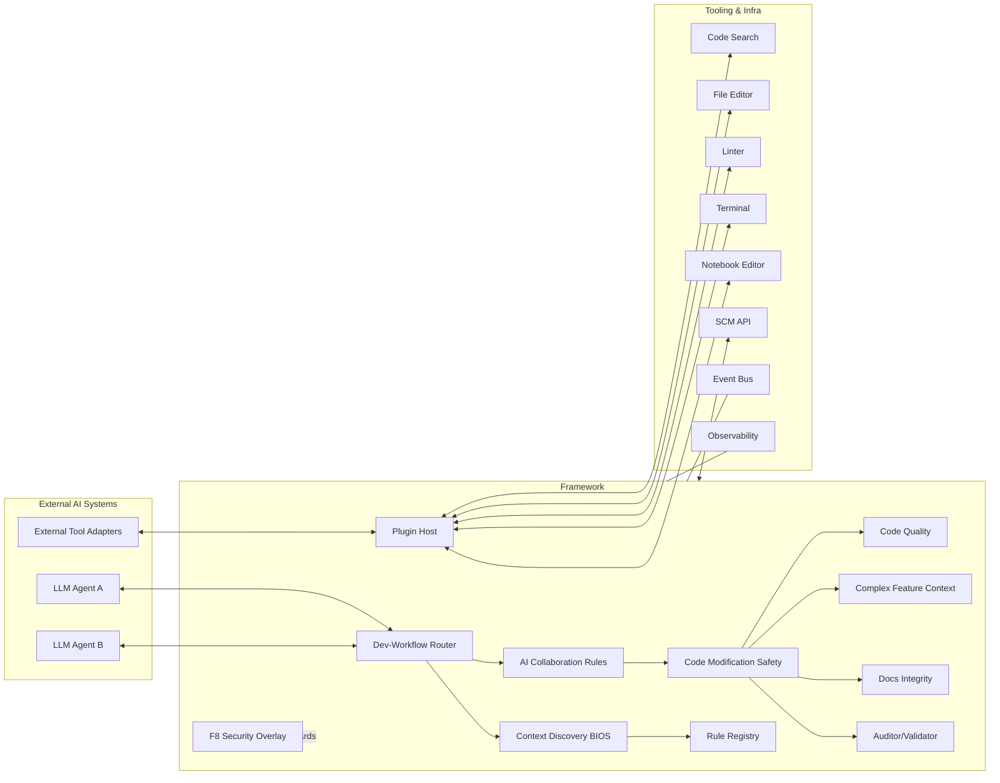
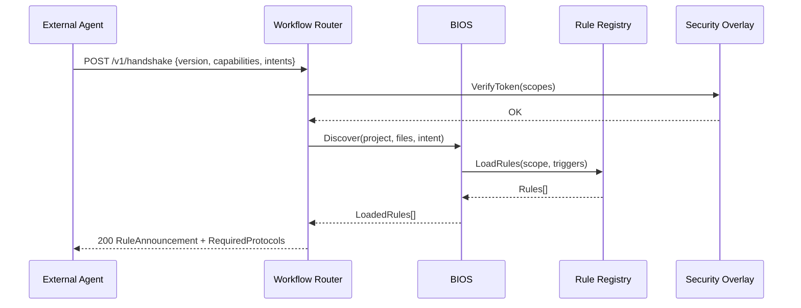
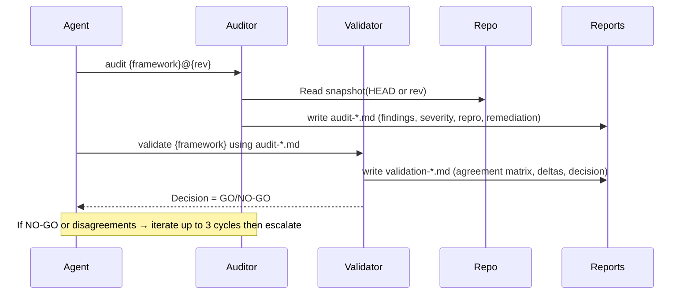

### Extensibility and Integration Architecture for the Rule Governance Framework

This document defines how to integrate and extend the governance framework with other AI systems. It specifies components, interfaces, protocols, message contracts, and security/observability requirements.

---

## 1) High-Level Component Architecture



Key ideas:
- External agents integrate through the Router using typed protocols and capability handshakes.
- The BIOS loads rules and project context; the Security Overlay guards all calls.
- Tooling is abstracted via the Plugin Host; providers can be swapped without changing governance logic.
- Observability and Event Bus provide telemetry and decoupled automations.

---

## 2) Integration Scenarios

- **Embedded Policy Engine**: Framework runs in-process; the external agent invokes local interfaces (function calls or IPC).
- **Sidecar Orchestrator**: Framework runs adjacent to agents; communication via HTTP/gRPC/WebSocket and event bus.
- **Multi-Agent Coordinator**: Multiple agents coordinate through Router; Auditor→Validator sessions run as independent agents.

---

## 3) Protocols and Sequences

### 3.1 Capability Handshake and Rule Announcement



### 3.2 Audit → Validate Convergence Loop



---

## 4) Transport Options

- **HTTP/JSON (REST)**: Simple integration for most agents; supports SSE for streaming.
- **gRPC**: Strong typing and streaming; recommended for high-throughput integrations.
- **Event Bus (NATS/Kafka/RabbitMQ)**: Pub/Sub for events and decoupled workflows.
- **WebSocket/SSE**: Real-time progress and status updates.

---

## 5) Authentication and Authorization

- **AuthN**: OAuth2 Bearer (JWT), mTLS for service-to-service; API keys for local development only.
- **AuthZ Scopes**: `rule:read`, `rule:apply`, `context:discover`, `task:write`, `tool:exec`, `repo:read`, `repo:write`, `audit:run`, `validate:run`, `logs:write`.
- **Security Overlay (F8)**: Enforce encryption in transit, remove hardcoded secrets, validate inputs, and maintain audit logs.

---

## 6) HTTP API Surface (REST)

- `POST /v1/handshake` → CapabilityHandshakeRequest → RuleAnnouncementResponse
- `GET /v1/rules` → list available rules and metadata
- `POST /v1/context/discover` → ContextDiscoverRequest → ContextDiscoverResponse
- `POST /v1/tasks/plan` → PlanRequest → PlanResponse
- `POST /v1/todos` → TodoBatchUpsert
- `POST /v1/impact-analysis` → ImpactAnalysis
- `POST /v1/modification-report` → ModificationReport
- `POST /v1/docs/sync` → DocsSyncProposal
- `POST /v1/audit/run` → AuditRunRequest
- `POST /v1/validate/run` → ValidationRunRequest
- `GET /v1/events` (SSE) → stream of governance events

---

## 7) Event Topics (Event Bus)

- `gov.rule.announcement`
- `gov.task.updated`
- `gov.safety.impact`
- `gov.modification.report`
- `gov.docs.sync.requested`
- `gov.audit.created`
- `gov.validation.created`
- `gov.security.alert`

---

## 8) Data Contracts (JSON Schemas)

```json
{
  "$schema": "https://json-schema.org/draft/2020-12/schema",
  "$id": "https://example.com/schemas/CapabilityHandshakeRequest.json",
  "type": "object",
  "required": ["agent", "capabilities", "intents"],
  "properties": {
    "agent": {
      "type": "object",
      "required": ["name", "version"],
      "properties": {
        "name": {"type": "string"},
        "version": {"type": "string"}
      }
    },
    "capabilities": {"type": "array", "items": {"type": "string"}},
    "intents": {"type": "array", "items": {"type": "string"}},
    "auth": {
      "type": "object",
      "properties": {
        "type": {"enum": ["bearer", "mtls", "apikey"]},
        "token": {"type": "string"}
      }
    }
  }
}
```

```json
{
  "$schema": "https://json-schema.org/draft/2020-12/schema",
  "$id": "https://example.com/schemas/RuleAnnouncementResponse.json",
  "type": "object",
  "required": ["loadedRules", "requiredProtocols"],
  "properties": {
    "loadedRules": {
      "type": "array",
      "items": {
        "type": "object",
        "required": ["name", "scope", "priority"],
        "properties": {
          "name": {"type": "string"},
          "scope": {"type": "string"},
          "priority": {"type": "integer"},
          "description": {"type": "string"}
        }
      }
    },
    "requiredProtocols": {"type": "array", "items": {"type": "string"}}
  }
}
```

```json
{
  "$schema": "https://json-schema.org/draft/2020-12/schema",
  "$id": "https://example.com/schemas/ImpactAnalysis.json",
  "type": "object",
  "required": ["targetFile", "fileType", "riskLevel"],
  "properties": {
    "targetFile": {"type": "string"},
    "fileType": {"enum": ["single-feature", "multi-feature"]},
    "featuresDetected": {"type": "array", "items": {"type": "string"}},
    "affectedComponents": {"type": "array", "items": {"type": "string"}},
    "modifiedFunctions": {"type": "array", "items": {"type": "string"}},
    "testsIdentified": {"type": "integer"},
    "riskLevel": {"enum": ["LOW", "MEDIUM", "HIGH"]}
  }
}
```

```json
{
  "$schema": "https://json-schema.org/draft/2020-12/schema",
  "$id": "https://example.com/schemas/ModificationReport.json",
  "type": "object",
  "required": ["changes", "functionalityPreserved"],
  "properties": {
    "changes": {"type": "string"},
    "functionalityPreserved": {"type": "array", "items": {"type": "string"}},
    "newRisks": {"type": "array", "items": {"type": "string"}},
    "recommendedTests": {"type": "array", "items": {"type": "string"}}
  }
}
```

```json
{
  "$schema": "https://json-schema.org/draft/2020-12/schema",
  "$id": "https://example.com/schemas/AuditRunRequest.json",
  "type": "object",
  "required": ["framework", "rev"],
  "properties": {
    "framework": {"type": "string"},
    "rev": {"type": "string"},
    "plannerArtifacts": {"type": "array", "items": {"type": "string"}}
  }
}
```

```json
{
  "$schema": "https://json-schema.org/draft/2020-12/schema",
  "$id": "https://example.com/schemas/ValidationRunRequest.json",
  "type": "object",
  "required": ["framework", "auditReport"],
  "properties": {
    "framework": {"type": "string"},
    "auditReport": {"type": "string"}
  }
}
```

---

## 9) Plugin Interfaces (Provider Model)

```typescript
interface ToolProvider {
  name: string;
  capabilities(): string[]; // e.g., ["search", "edit", "lint", "terminal", "notebook"]
  search(query: string, options?: object): Promise<object>;
  readFile(path: string): Promise<string>;
  writeFile(path: string, content: string): Promise<void>;
  runLinter(paths: string[]): Promise<object[]>;
  runCommand(cmd: string, opts?: { background?: boolean }): Promise<{ status: number; stdout: string; stderr: string }>;
}

interface RuleRegistry {
  list(scope?: string): Promise<RuleMeta[]>;
  load(selectors: { scope?: string; triggers?: string[]; tags?: string[] }): Promise<Rule[]>;
}
```

Providers register via the Plugin Host, advertising capabilities; the Router chooses providers at runtime according to the Tool Usage Protocol.

---

## 10) Governance Alignment

- **Precedence**: Security Overlay → Auditor/Validator → Safety → Quality → Complex Feature → Collaboration → Docs → Router.
- **Security**: TLS/mTLS, bearer scopes, input validation, no hardcoded secrets, comprehensive logging.
- **Safety**: Impact analysis and risk gating before edits; rollback on anomalies.
- **Docs**: Sync required when behavior diverges.
- **Auditability**: All critical paths emit audit/validation artifacts with signoffs.

---

## 11) Non-Functional Requirements

- **Idempotency**: All POST endpoints accept client-generated `idempotencyKey`.
- **Retries**: Exponential backoff; server responses include `retryAfter` when applicable.
- **Versioning**: `X-Gov-Version: semver`; handshake returns negotiated protocol versions.
- **Observability**: Structured logs, metrics, traces; correlation IDs on all requests.

---

## 12) Example: External Agent Integration Flow

1) Agent calls `POST /v1/handshake` with capabilities and intents.
2) Router verifies scopes, runs BIOS discovery, returns `RuleAnnouncement`.
3) Agent submits `tasks/plan` and begins execution using declared tools via Plugin Host.
4) For code changes, Agent posts `impact-analysis` → if MED/HIGH, waits for approval or refuses.
5) After implementation, Agent posts `modification-report` and, if applicable, `docs/sync`.
6) For critical paths, Agent triggers `audit/run` followed by `validate/run` until GO.

