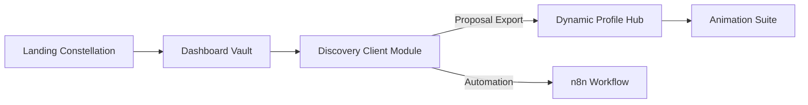

# Architecture Overview

## Data Flow

1. **Synthetic Data** – `faker` seeds Fintech/Healthcare pods inside `getDashboardVaultData()`.
2. **State Management** – `usePersonaStore` (Zustand) tracks persona context across routes.
3. **API** – `/api/intake` classifies discovery responses and returns recommended pod + KPIs.
4. **Visualization** – Recharts, deck.gl, Observable Plot, and Three.js power interactive dashboards.
5. **Automation** – `automation/n8n/intake-to-proposal.json` orchestrates intake → OpenAI summarization → CRM + email.
6. **Analytics** – `initializeAnalytics` bootstraps PostHog & Hotjar, events fired from persona/pod/intake interactions.

## Component Tree (Simplified)

- `app/layout.tsx`
  - `Providers`
    - `GalaxyNav`
    - `LandingPageClient` / `DashboardClient` / etc.
- `app/(landing)` – persona-driven landing with 3D mosaic
- `app/dashboard` – Fintech & Healthcare pods with scenario simulator
- `app/discovery` – intake form, transcript, proposal exporter
- `app/profile` – timeline, testimonials, CTA modals
- `app/animations` – animation presets, narrative sequencer

## TODO Integrations

- Connect Supabase/Firebase for persistence (current data synthetic)
- Hook Sanity/Contentful for CMS-managed copy
- Provide real OpenAI + LangChain workflows for proposal generation
- Add Playwright smoke tests + Storybook coverage
- Wire PostHog dashboards for event analysis
